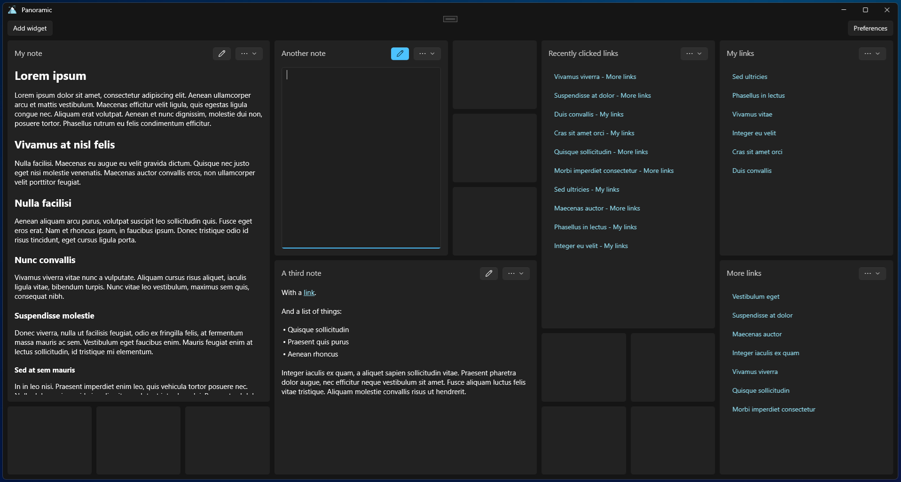

# Panoramic

A productivity app that revolves around a high-level view of notes and links.

## Features

Organized as a grid system, it allows you to add widgets in a layout that you prefer.

Currently supports 3 types of widgets:

- Note - textual widget that supports simplified markup
- Link collection - a collection of links ordered to your preference
- Recent links - links that were recently clicked within the app

## Storage

All of the data is stored in JSON and markdown files in the Documents folder (or another of your preference).

## License

This project is licensed under the GNU GPLv3 License - see the [LICENSE](LICENSE) file for details.
