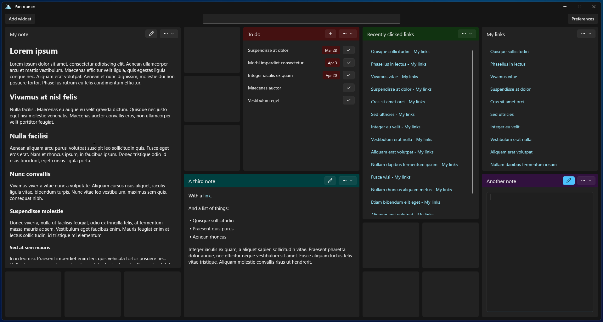
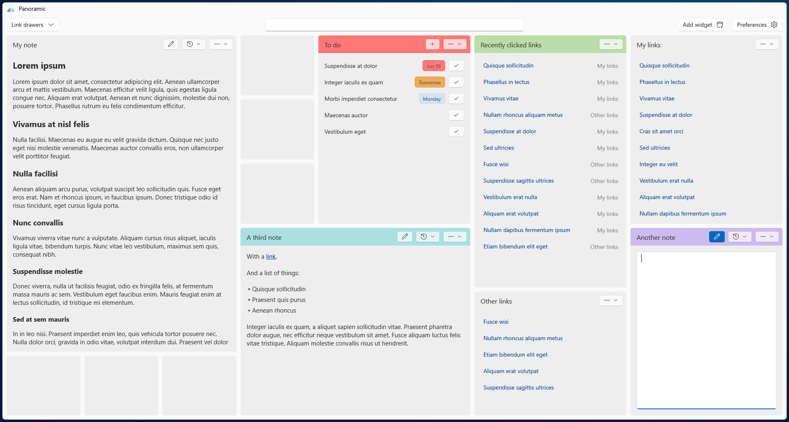

# Panoramic

A productivity app that revolves around a high-level view of notes, links, and checklists.

Organized as a grid system, it allows you to add widgets in a layout that you prefer.

---

## Widgets

Currently supports 4 types of widgets.

### Note

Textual widget that supports simplified markup.

### Link collection

A collection of links ordered to your preference. Searchable through the global search (Ctrl+S).

### Recent links

Links that were recently clicked within the app. Searchable through the global search (Ctrl+S).

### Checklist

A collection of tasks. Searchable through the global search (Ctrl+S). You can add new ones quickly using the Ctrl+T hotkey (only works when you have a single Checklist widget).

---

## Storage

I wanted to make the app easy to onboard to, but I also wanted to make it easy to off-board from. All of the data is stored in markdown files in the folder specified in Preferences, so if you decide to dip out it should be fairly easy to do so without losing your data to a proprietary format.

An example of how the markdown files are formatted can be seen in the [MarkdownSamples folder](/test/Benchmarks/MarkdownSamples).

---

## License

This project is licensed under the GNU GPLv3 License - see the [LICENSE](LICENSE) file for details.
