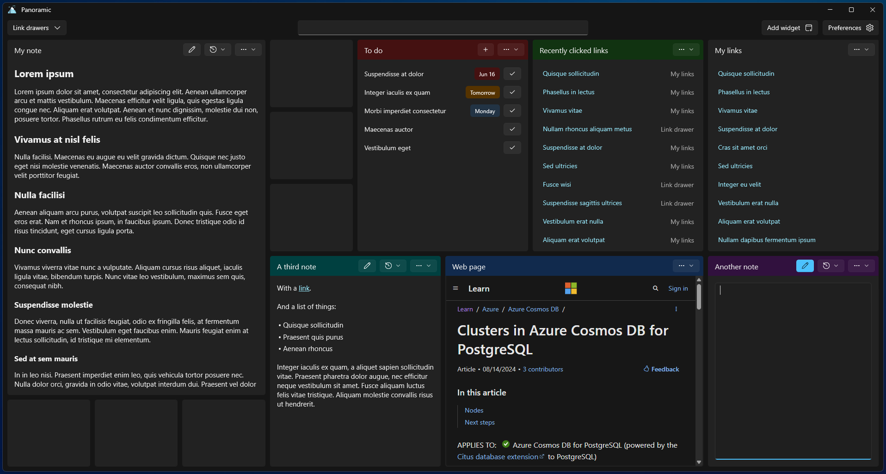
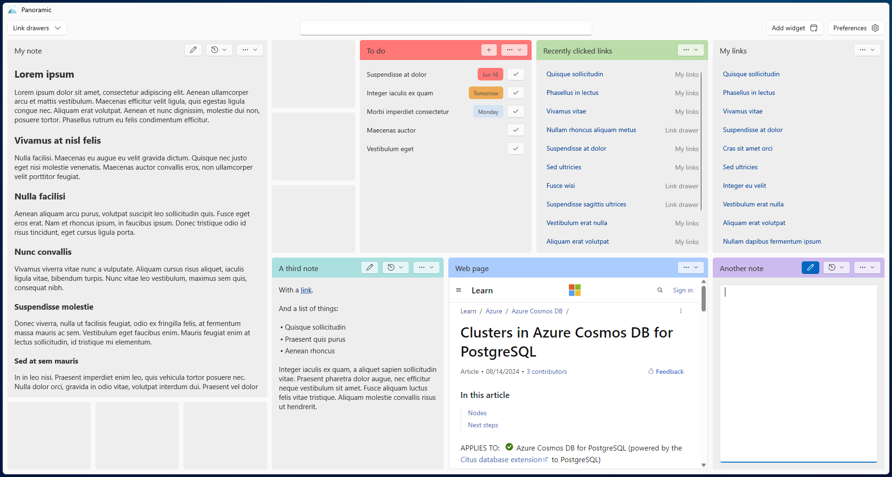

# Panoramic

A productivity app that revolves around a high-level view of notes, links, and checklists.

Revolves around two concepts:

1. [Widgets](#widgets) - different types of functionalities organized as a grid system, in a layout of your choosing
2. [Link drawers](#link-drawers) - collections of links that are less frequently accessed, tucked away in a menu

---

## Widgets

Currently supports 5 types of widgets.

### Note

Textual widget that supports simplified markup. 

### Link collection

A collection of links ordered to your preference.

### Recent links

Links that were recently clicked within the app. 

### Checklist

A collection of tasks (to-dos).

### Web view

Host a web page from a specified URI.

## Link drawers

All of the links that you don't need to always see on your screen, reachable using the top-left "Link drawers" menu or the `Ctrl+D` hotkey.

---

## Hotkeys

### General

| Hotkey | Command |
|-|-|
| Ctrl+S | Filters the list of links in Link Collection and Recent Links widgets and tasks in the Checklist widgets |
| Ctrl+D | Opens a dialog to search for links from the link drawers |

### Note widget

| Hotkey | Command | Caveat |
|-|-|-|
| Ctrl+N | Opens a dialog for creating a new note | Only works when you have a single Note widget |

### Checklist widget

| Hotkey | Command | Caveat |
|-|-|-|
| Ctrl+T | Opens a dialog for creating a new task | Only works when you have a single Checklist widget |

---

## Storage

I wanted to make the app easy to onboard to, but I also wanted to make it easy to off-board from. All of the data is stored in markdown files in the folder specified in Preferences, so if you decide to dip out it should be fairly easy to do so without losing your data to a proprietary format.

An example of how the markdown files are formatted can be seen in the [MarkdownSamples folder](/test/Benchmarks/MarkdownSamples).
